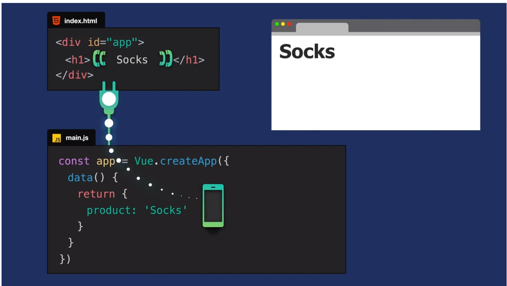
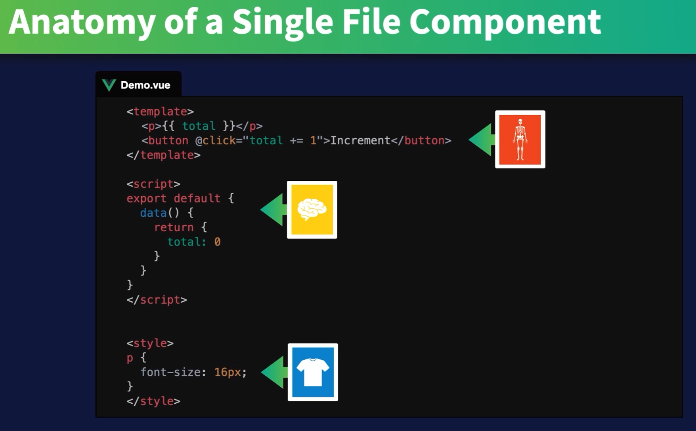
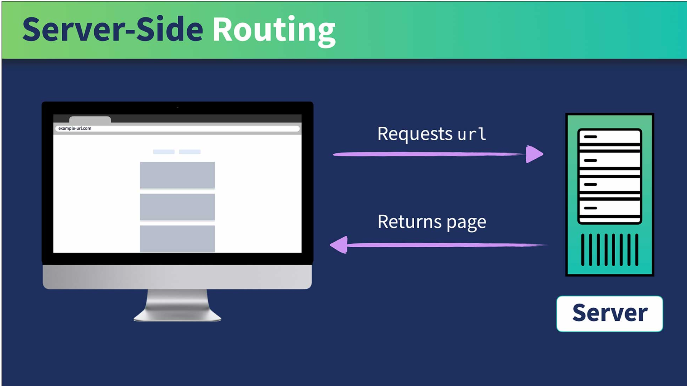
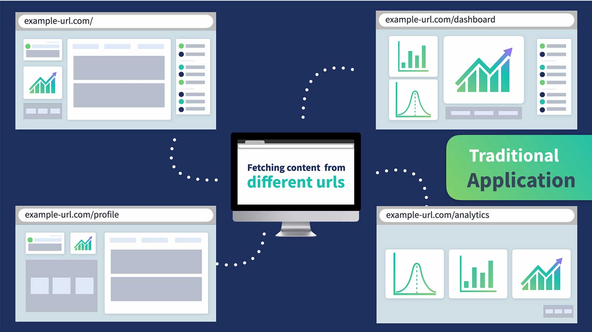
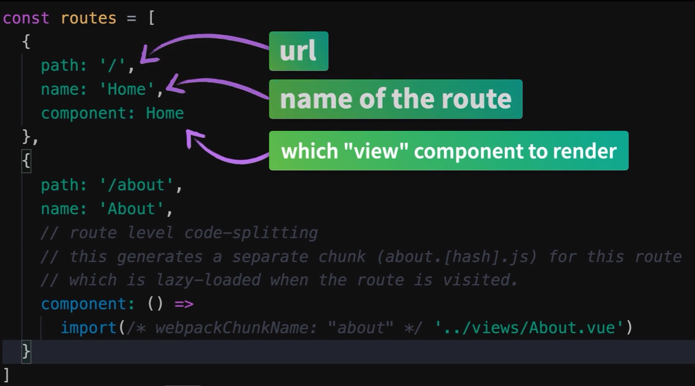

# Vue

### Creating a Vue App

<br/>
To display data within the HTML. 
Create the following in
<strong> main.js</strong>

```
const app=Vue.createApp({})
```

Added an argument to pass in an object and add a data property.
This is a function which returns another object.
Still working in <strong> main.js </strong>

```
const app=Vue.createApp({
    data(){
        return {
            product: 'Socks'
        }
    }
})
```

Make sure to <strong>import </strong> the Vue App into the html file.

<strong>index.html</strong>

```
<!-- Import App -->
<script src="./main.js></script>
```

### Mouting the App

Mount the app into the DOM (Document Object Model)

<strong>index.html</strong>

```
<script>
    const mountedApp = app.mount ('#app')
</script>
```

app here refers to the const app created in <strong>main.js</strong>

### Showing Data

in <strong>index.html</strong> you will write the data between {{}}

```
<div id="app">
<h1> {{product}} </h1>
</div>

```

This returns: Socks

### image explaining the vue instance



<br/>

# Attribute binding

### adding an img element

**main.js**

```
const app = Vue.createApp({
    data() {
        return {
            product:'Socks',
            image:'/assets/images/socks_green.jpg'
        }
    }
})
```

**index.html**

```
<div class="product-image">

</div>
```

### Understanding v-bind

<br/>
<br/>
<br/>
<br/>
<br/>
<br/>
<br/>

# Vue course - Real World Vue

### Vue CLI

installing the CLI

```
npm i -g @vue/cli
# OR
yarn global add @vue/cli
```

### Creating a Vue Project

```
vue create real-world-vue
```

```
npm run serve
```

**How Vue works**


### Single file Components

_You know this already_



## Vue Router essentials

### Server-Side Routing

_The client makes a request to the server on ever link click_



<br/>
<br/>
<br/>



### Client-Side Routing

_In Vue, Client-side routing is more common._


### Single Page applications

**Single Page Applications(SPA)**
Web app that loads from a single page and dynamically updates the page if it's interachted with.
Everything is being loaded from the **index.html**

this document contains a div with an id of "app"" and is the "single page".
**public/index.html**

```
<div id="app"></div>
```

in **main.js** you can see when the app is created, it's being mounted to the `div` with the id of the `#app`.

**main.js**

```
createApp(App)
.use(store)
.use(router)
.mount('#app')
```



## Api calls with Axios

mock data server: my-json-server

cmd -> vue ui --> install dependencies --> Axios

### Lifecycle Hooks

```
<ul>
<li>beforeCreate </li>
<li>created </li>
<li>beforeMount </li>
<li>mounted </li>
<li>beforeUpdate </li>
<li>updated </li>
<li>beforeUnmount </li>
<li>unmounted </li>
<li>errorCaptured </li>
<li>renderTracked </li>
<li>renderTriggered </li>
</ul>
```

**Check your data**

```
 created() {
    axios
      .get(
        'https://my-json-server.typicode.com/Code-Pop/Real-World_Vue-3/events'
      )
      .then((response) => {
        console.log('events:', response.data)
      })
      .catch((error) => {
        console.log(error)
      })
  },
}
```

You can easily check the data that you get by console logging it and also catching the error.

If multiple components use axios, create one instance where you import axios.

**src/services/EventService.js**

```
import axios from 'axios'

//Single Axios instance for the entire app
const apiClient = axios.create({
  baseURL: 'https://my-json-server.typicode.com/Code-Pop/Real-World_Vue-3',
  withCredentials: false,
  headers: {
    Accept: 'application/json',
    'Content-Type': 'application/json',
  },
})

export default {
  getEvents() {
    return apiClient.get('/events')
  },
}
```

Then instead of importing axios in **EventList.js** you import..... EventService

```
created() {
    EventService.getEvents()
      .then((response) => {
        this.events = response.data
      })
      .catch((error) => {
        console.log(error)
      })
  },
}
```

## Dynamic Routing

dynamic segment `:id`

```
 {
    path: '/event/:id',
    name: 'EventDetails',
    component: EventDetails,
  },
```

Give EventDetails acces to params as a property

```
<template>
<router-link to="{name: 'EventDetails', params: {id: event.id}}">
  <div class="event-card">
    <span>@ {{ event.time }} on {{ event.date }}</span>
    <h4>{{ event.title }}</h4>
  </div>
</router-link>
</template>
```

**Caveat**

There is a caveat; your server will no longer report 404 errors as all not-found paths now serve up your index.html.
To get around this issue implement a catch-all route within your Vue app to show a 404 page:
