# Angular getting started

# Testing

Testing tools:

- Karma
- Protractor
- alternatives:
  - Jest
  - theIntern
  - Cypress.io
- Angular Testing Utilities
  - TestBed
  - Async & FakeAsync
  - MockBackend

# Pipes

**Pure vs. impure**

- **Pure**
  - only evaluated when imput changes (simple)
- **Impure**
  - evaluated on every change detection cycle (complex)

## Examples

```
{{ product.productCode | lowercase }}
< img [src] = 'product.imageUrl'
      [title]='product.productName | uppercase'>

{{ product.price | currency | lowercase }}
{{product.price | currency:'USD':'symbol':'1.2-2'}}
```

The 1.2-2 means there is 1 number before the . there are 2 behind and no more then 2 behind the ...

## Custom Pipe

```
import { PIpe, PipeTransform } from '@angular/core';

<!-- pipe decorator to define it as a pipe- it's a function so it requires{} -->
@Pipe ({
  name: 'convertToSpaces'
})

<!-- class -->
export class ConvertToSpacesPipe implements PipeTransform {

<!-- Here we transform a string  -->
  transofrm (value: string,
              character: string): string
              }
}
```

# Components


```

import { Component } from '@angular/core';

@Component({
selector: 'pm-root',
template:` <div><h1>{{pageTitle}}</h1> <div>My First Component</div> </div> `
})
export class AppComponent {
pageTitle: string = 'Acme Product Management';
}

```

## Creating Component class

A class is a construct that allows us to create a type with properties that define the data elements and methods that provide functionality.

convention:

- Name each component class with a feature name + component
- root component for an application is called AppComponent

```

pageTitle: string = 'Acme Product Management';

```

- Property name = noun describing the data element & camelCase;
- _pageTitle_
- Data Type = string, integer, float, character, boolean;
- _string_
- Default Value

## Defining the Metadata

**Decarator**

- is a function that adds _metadata_ to a class, its members, or its method arguments
- Prefixed with an @.
- Apply the decorator immediately before the feature you are decorating
- component always has a template

```

@Component({
selector: 'pm-root',
template:` <div><h1>{{pageTitle}}</h1> <div>My First Component</div> </div> `
})

```

## import statement

Allows us to use exported members from:

- other files in the application
- Angular framework
- external JS libraries

In the example we import from angular core

```

import { Component } from '@angular/core';

```

import = keyword
component = member name
@angular/core= angular library + module name

## Component checklist

Class -> Code
Decorator -> Template & Metadata
Import what you need

## Class

Clear name

- use PascalCasing
- Append "Component" to the name

export **keyword**

## Members

Data in properties

- Appropriate data type
- Appropriate default Value
- camelCase

Logic in methods

- camelCase

## Metadata

**Component decorator**

- prefix with @; Suffix with ()

**selector**: Component name in HTML

- Prefix for clarity

**Template**: view's in HTML

- Correct HTML syntax

## Import statement

- Defines where to find members that this component needs
- import keyword
- Member name: correct spelling/PascalCasing
- Path: Enclose in quotes, correct spelling/casing

## Defining interfaces

**An interface is a specification identifying a related set of properties and methods** </br>
_properties are the data elements associated with the class, and methods perform the logic required for the class_

### Two ways to Use an interface

**As a data type**

```

export interface IProduct {
productId: number;
productName: string;
productCode: string;
realeaseDate: string;
price: number;
description: string;
starRating: number;
imageUrl: string;
}

```

```

products: Iproduct[] = [];

```

**As a feature set**

```

export interface DoTiming {
count: number;
start (index: number): void;
stop(): void;
}

```

```

export class myComponent
implements DoTiming {
count: number = 0;
start(index: number): void {
...
}
stop(): void {
...
}
}

```

```

export interface IProduct {
productId: number;
productName: string;
productCode: string;
realeaseDate: string;
price: number;
description: string;
starRating: number;
imageUrl: string;
}

```

**export**= keyword </br>
**interface**= keyword </br>
**Iproduct**= interface name - usually with I for interface as prefix

Once you have defined the interface, you can import it as a datatype

```

import { IProduct } from './product';

export class ProductListComponent {
pageTitle: string = 'Product List';
showImage: boolean = 'false';
listFilter: string = 'cart';

products: Iproduct[]=[...];

toggleImage():void {
this.showImage = !this.showImage;
}
}

```

# Component styles

### Encapsulating Component styles

Using the styles property

```

@Component({
selector:'pm-products',
templateUrl:'./product-list.component.html'
styles: ['thead {color: #337AB7;}']
})

```

Using the StyleUrl property

```

@Component({
selector:'pm-products',
templateUrl:'./product-list.component.html'
styleUrls:['./product-list.component.css']
})

```

# Component Lifecycle

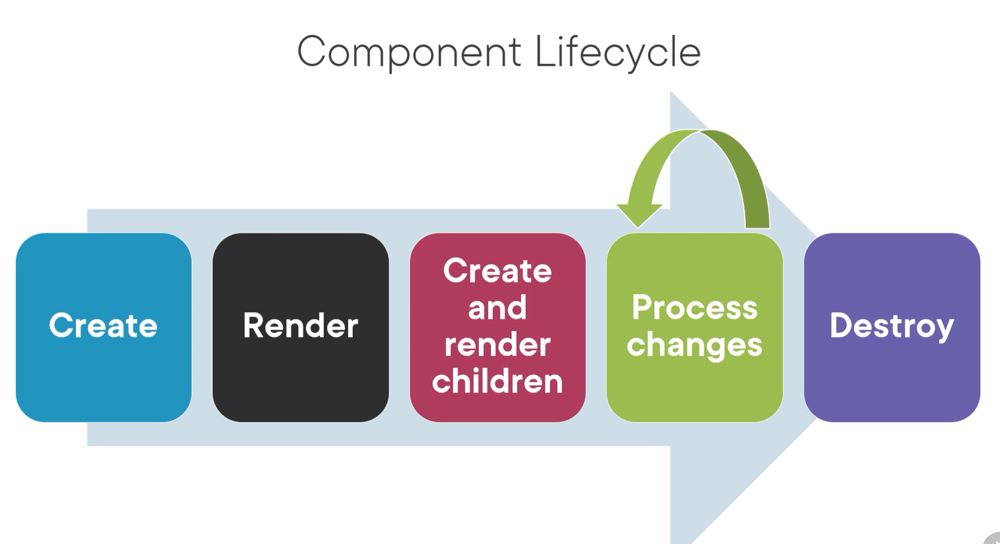

 </br>
 </br>

_A Lifecycle hook is an interface we implement to write code when a component lifecycle event occurs._

## What makes a component nest-able?

1. Its template manages a fragment of a larger view
2. It has a selector (so it can be used as a directive )
3. It optionally communicates with its container

## Three most common lifecycle hooks

1. OnInit: Perform component initialization, retrieve data
2. onChanges: Perform action after change to input properties
3. OnDestroy: Perform cleanup

## Using a lifecycle hook

```

<!-- Step one -->

import { Component, OnInit } from '@angular/core';

<!-- Step two -->

export class ProductListComponent implements OnInit {
pageTitle: string = 'Product List';
showImage: boolean = false;
listFilter: string = 'cart';
products: IProduct[] = [...];

  <!-- Step three -->

ngOnInit(): void {
console.log('In OnInit');
}
}

```

# Data Binding

## Interpolation

one-way binding; from the class property to the template

{{pageTitle}} --> is called a Template Expression
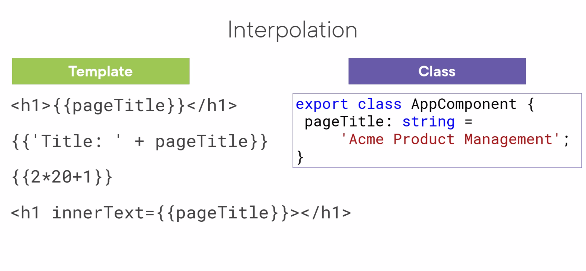

# Logic with Directives

## Angular built-in Directives

Structural Directives :

- \*ngIf: If Logic
- \*ngFor: For loops

\*ngIf removes or recreates a portion of the document object model tree based on an expression.

\*ngFor Buil-inDirective repeats a portion of the DOM tree of each item in an irreterable list

let product creates a variable called product so you can reference this variable

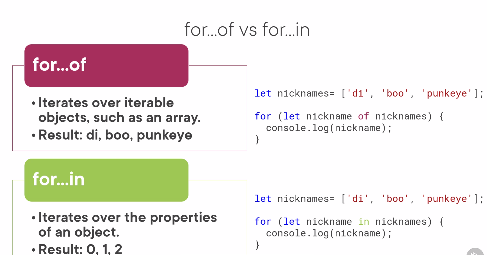

Difference - in as in iterating the INdex

# Template checklist

**inline template:**

- for short templates
- specify the template property
- use the ES 2015 back ticks for multiple lines
- watch syntax

```

template:

<div> <h1> {{pageTitle}}</h1>
<div> My First Component </div>
</div>
```

**Linked template**

- For longer templates
- specify the templateUrl Property
- Define the path to the HTML file

```
templateUrl: './product-list.component.html'
```

**Interpolation**
_One way binding_

- From component class property to an element property
  _Defined with double curly braces_
- Contains a template expression
- No quotes needed

```
<td>{{product.productName}}</td>
```

**Structural directives**

*ngIf and *ngFor

- prefix with an asterisk
- Assign to a quoted string expression

**\*ngIF**

Add or remove an element and its children from the DOM

expression is evaluated:

- **true**: elements added to the DOM
- **false**: elements removed from the DOM

```
<table *ngI='products'>
```

**\*ngFor**
Repeat an elemen and its children in the DOM

- For each object in an iterable list

Define the local variable with let
specify 'of'

```
<tr *ngFor='let product of products'>
...
</tr>
```

# Property Binding

```

```

<[element propert] = 'template.Expression'>

# Event Binding

**Template**

```
<h1> {{pageTitle}}</h1>

<button (click)='toggleImage()'>
```

**Component**

```
export class ListComponent {
  pageTitle = 'Product List';
  products: any[] = [...];
  toggleImage(): void {...}
}
```

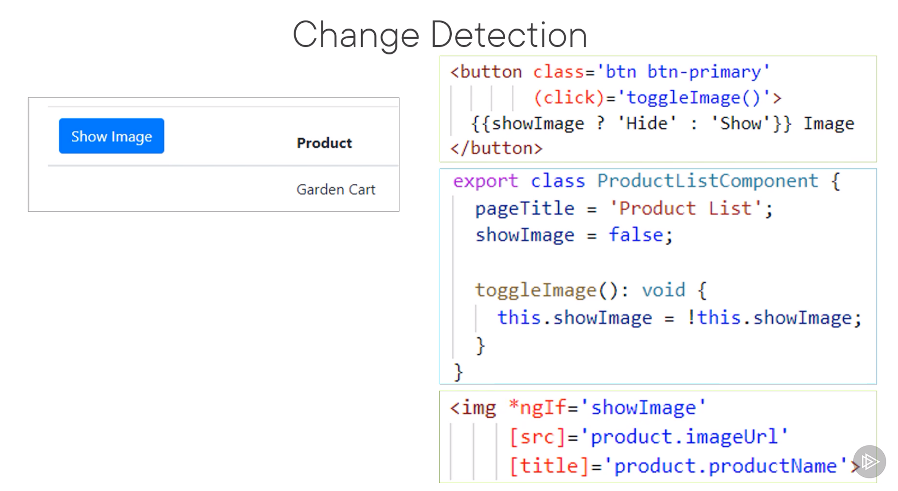

## Two-way binding

```
[(ngModel)]
```

Use a banana in a box [()]

# Data binding checklist & summary

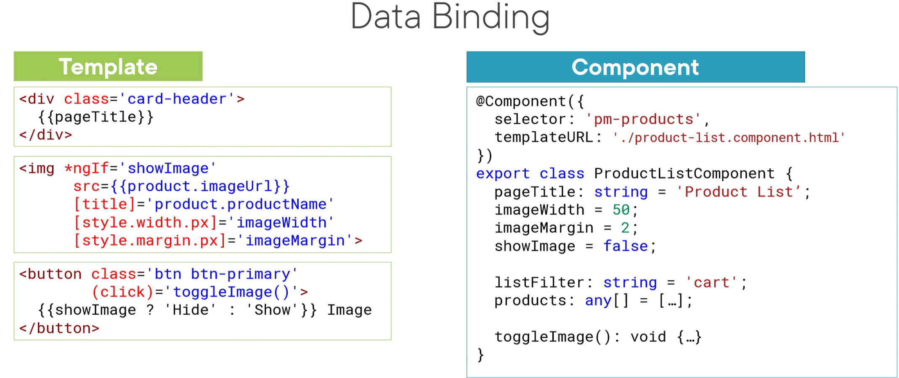
</br>
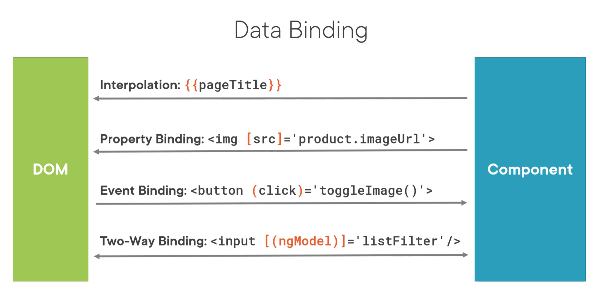

### ngModel

```
<div class='col-md-4'>
  <input type='text'
    [(ngModel)]='listFilter' />
</div>
```

```
@NgModule({
  imports: [ BrowserModule,
  FormsModule],
  declarations: [
    AppComponent,
    ProductListComponent  ],
    bootstrap:[AppComponent]
})
export class AppModule { }
```

### Pipes

Pipe character |
Pipe name
Pipe parameters

- separated with colons

Example

```
{{ product.price | currency: 'USD': 'symbol': '1.2-2'}}
```

# Filtering a List

```
products: IProduct[] = [...];
```

```
performFilter(): IProduct[] {
  return this.products.filter((product: IProduct) =>
      product.productName.includes(this.listFilter));
}
```

# Getters & Setters

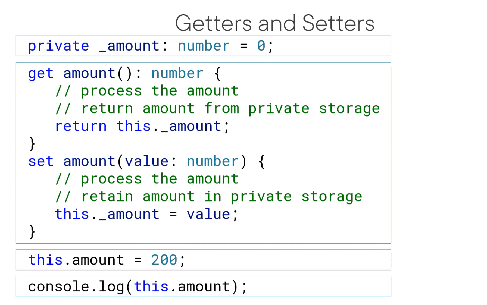
</br>
</br>
</br>
</br>
</br>

# Arrow Function

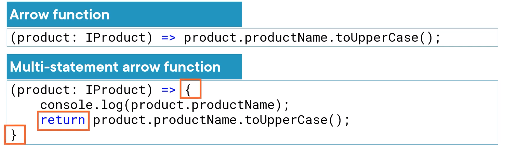

# Interface Checklist:

## Interface as a type

- interface keyword
- Properties and their types
- export it

```
export interface IProduct {
  productId: number;
  productName: string;
  productCode: string;
  ...
}
```

- Use the interface as a data type

```
products: IProduct[] = [...];
```

## Interface as a Feature set

**Implementing interfaces:**

- implements keyword & interface name
- Write code for each property & method

```
import { Component, OnInit } from '@angular/core';

export class ProductComponent implements OnInit {
  ngOnInit(): void {
    console.log( 'In OnInit');
  }
}
```

# Styles Checklist

## Encapsulating Styles

**Styles property**

- Specify an array of style strings
  **styleUrls property**
- Specify an array of stylesheet paths []

# Lifecycle hook

## Using Lifecycle hooks

1. Import the lifecycle Hook interface
2. Implement the lifecycle hook interface
3. Write code for the hook method

```
import { Component, OnInit } from '@angular/core';

export class ProductComponent implements OnInit {
  ngOnInit(): void {
    console.log ('In OnInit');
  }
}
```

# Pipe Checklist

## Building a Custom Pipe

Create a class that implements PipeTransform
Write code for the Transform method
Decorate the class with the Pipe decorator

```
import { Pipe, PipeTransform } from '@angular/core';

@Pipe({
  name: 'spacePipe'
})
expor class SpacePipe implements PipeTransform {
  transform( value: string,
  character: string): string { ...}
}
```

## Using a custom Pipe

Add the pipe to the delcarations array of an Angular module

```
@NgModule({
  imports: [...],
  declarations: [
    AppComponent,
    ProductListComponent,
    SpacePipe ],
    bootstrap: [ AppComponent ]
})
export class AppModule { }
```

Use the pipe in a template:

- Pipe character
- Pipe name
- Pipe arguments(separated with colons)

```
{{ product.productCode | spacePipe: '-'}}
```

# Nested Component Checklist

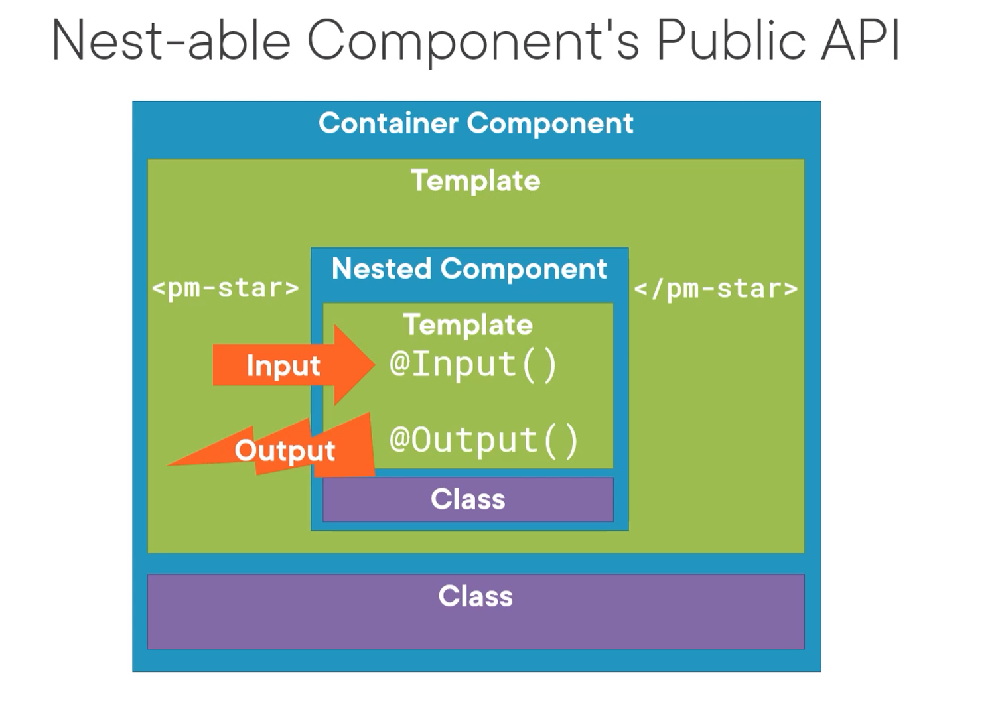

## Input properties

- input decorator
- Attach to a property of any type
- Prefix with @ Suffix with ()

```
export class StarComponent {
  @Input() rating: number;
}
```

## Output properties

- output decorator
- Attached to a property declared as an EventEmitter
- Use the generic argument to define the event data type
- Use the new keyword to create an instance of the EventEmitter
- prefix with @; Suffix with ()

```
export class StarComponent {
  @Output() notify: EventEmitter<string> =
                          new EventEmitter<string>();
}
```

## Container Component

- Use the directive
  - Directive name -> nested component's selector
- Use property binding to pass data to the nested component
- Use event binding to respond to events from the nested component
  - Use $event to access the event data passed from the nested component

```
<pm-star [rating]='product.starRating'
          (notify)='onNotify($event)'>
</pm-star>
```

# Dependency injection

_A coding pattern in which a class receives the instances of objects it needs (called dependencies) from an external source rather than creating them itself._

## Building services

**Product.service.ts**

```
import { Injectable } from '@angular/core'

@Injectable()
export class ProductService {
  getProducts(): IProduct [] {

  }
}
```

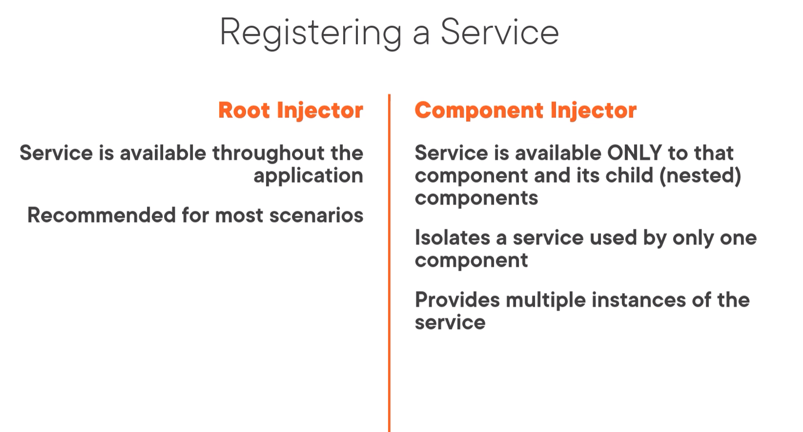

## Registering a Service - Root application

**product.service.ts**

```
import { Injectable } from '@angular/core'

@Injectable({
  providedIn: 'root'
})
export class ProductService {
  getProducts(): IProduct[] {
  }
}
<!-- This service is available everywhere -->
```

**product-list.component.ts**

```
@Component({
  templateUrl: './product-list.component.html'
  providers: [ProductService]
})
export class ProductListComponent { }
<!-- This service is available only within this component -->
```

**This is an older way to do it**

**app.module.ts**

```
@NgModule({
  imports: [BrowserModule],
  declarations: [ AppComponent],
  bootstrap: [AppComponent],
  providers: [ProductService]
})
export class AppModule{ }
```

## Injecting the service

Inpendency injection is done with a constructor

primarily used for initialization.

```
import { ProductService } from './product.service';

@Component({
  selector: 'pm-products',
  templateUrl:'./product-list.component.html'
})
export class ProductListComponent {
  <!-- private _productService;
  constructor(productService: ProductService) {
    this._productService = productService;
  } -->
  <!-- short-handed version -->
    constructor (private productService: ProductService) {}
}
```

# Service Checklist

## Building a service

**Service class**

- Clearname
- use PascalCasing
- Append "Service" to the name
- export keyword

**Service decorator**

- Use InjectablePrefix with @; suffix with ()

import what you need

```
import { Injectable } from '@angular/core';
@Injectable({
  providedIn: 'root'
})
export class ProductService {...}
```

## Registering a service

**Select the appropriate level in the hierarchy**

- Root application injector if the service is used througout the application
- Specific component's injector if only that component uses the service
  **Service Injectable decorator**
- Set the providedIn property to 'root'

```
@Injectable({
  providedIn:'root'
})
export class ProductService {...}
```

**Component decorator**

- Set the providers property to register the service

## Dependency injection

- Specify the service as a Dependency
- Use the constructor parameters
- Service is injected when component is instantiated

```
constructor(private productService: ProductService) { }
```

# Retrieving data using HTTP calls

_To understand the HTTP code, it's important to understand Reactive Extensions and Observables_

## Reactive EXtensions (RxJS)

- A library for composing data using observable sequences
- And transforming that data using operators
  - Similar to .NET LINQ operators
- Angular uses Reactive Extensions for working with data
  - Especially asynchronous data

### Synchronous vs. asynchronous

**Synchronous**: Real time - _like a phone call_
**Asynchronous**: No immediate response - _Like answering an email, you can do that whenever you want to_

**HTTP requests are asynchronous: request and response**
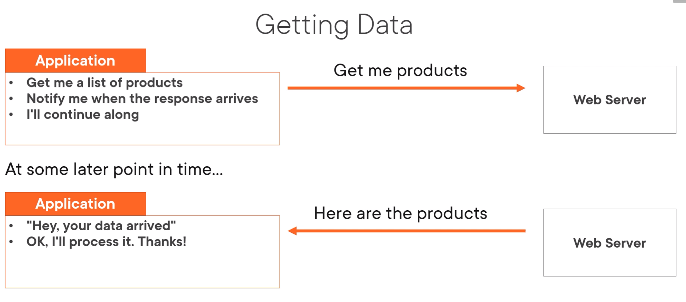

### Observable

A Collection of items over time

- Unlike an array, it doesn't retain items
- Emitted items can be observed over time
  - An observable is more like mouse clicks
  -

_What does an Observable do?_

- Nothing until we **subscribe**
- **Next:** next item is Emitted
  - Like tracking keypresses
- **Error:** An error occurred an no more items are Emitted
- **Complete:** No more items are emitted

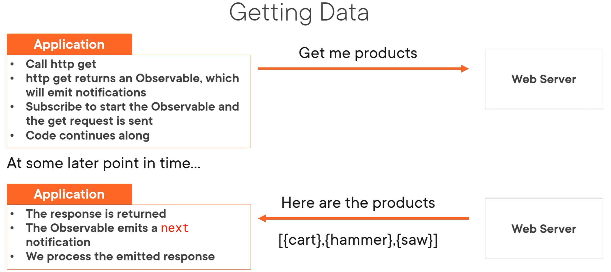
This is what the request and response looks like for the app

## Common Observable Usage

- Start the observable **subscribe**
- **Pipe** emitted items through a set of operators
- process notifications: **next, error, complete**
- Stop the Observable **unsubscribe**

**By convention**: suffix with a $ to reference to an observable
**Example**

```
import { Observable, range, map, filter } from 'rxjs';

const source$: Observable<number> = range(0, 10);

source$.pipe(
  map( x => x * 3),
  filter( x => x % 2 ===0)
).subscribe ( x => console.log(x));
```

map transform each emitted item multiplied by 3
filter decides which items to pass an and which to emit out.

## Exception Handling

```
import { HttpClient, HttpErrorResponse } from '@angular/common/http';
import { Observable, catchError, tap } from 'rxjs';

getProducts(): Observable<IProducts[]> {
  return this.http.get<IProducts[]> {
    tap(data => console.log('All: ', JSON.stringify(data))),
    catchError(this.handleError)
    );
  }
  private handleError(err: HttpErrorResponse) {
}
```
## Subscribing to an observable
observables are lazy, they don't do anything until you subscribe.
You subscribe with an observer - this observes the stream and responds to three types of notifications:
1. next
2. complete
3. error

The user object is used to define handler functions that execute on these notifications
next --> processes the next emitted value, it is called for each value the observable emits
error --> it executes if there is an error
complete --> executes on comopletions

```
x.subscribe()
x.subscribe(observer)
x.subscribe({
  nextFn,
  errorFn,
  completeFn
})
```

complete is rarely used with http requests because they automatically complete after emitting the single response.

## Unsubscribing from an observable

1. Store the subscription in a variable
2. Implement the OnDestroy lifecycle hook
3. Use the subscription variable to unsubscribe
   
You subscribe in the `ngOnInit()` 
e.g. 
```
ngOnInit(): void {
  this.sub = this.hello.getAnswers().subscribe){

  }
}
``` 
Then you unsubscribe in the `ngOnDestroy()`
```
ngOnDestroy(): void {
this.sub.unsubscribe();
}
```

# Navigation & Routing

- Routing is component based
- Angular provides a router module (RouterModule).
- The router uses a first match win strategy, so the order matters.


```
[
  { path: 'products', component: ProductListComponent },
  { path: 'products/:id', component: ProductDetailComponent },
  { path: 'welcome', component: WelcomeComponent },
  { path: '', redirectTo: 'welcome', pathMatch":'full' },
  { path: '**', component: PageNotFoundComponent }, 
  //wildcard
]
```
<strong>
Add each rtoute to `forRoot`array
</strong>

path: url segment for the route
- no leading slash
- '' for default route
- '**' for wildcart route

<strong> when you have routes configured, you need to tie them </strong>

add the RouterLink directive as an attribute
- clickable element
- enclose in square brackets

Bind to a link parameters array
- First element is the path
- All other elements are route parameters

Add RouterOutlet directive
- Identifies where to display the routed compobnent's view
- Specified in the host component's template

```
<ul> 
<li><a [routerLink]="['/welcome']">Home</a></li>
</ul>
<router-outlet></router-outlet>
```

## Passing parameters to a route

**app.module.ts - or routing.module.ts**
```
{ path: 'products/:id', component: ProductDetailComponent },
```

**product-list.component.html**
```
<td>
<a [routerLink]="['/products', product.productId]"> {{product.productName}}
</a>
</td>
```
**product-detail.component.ts**
```
import { ActivatedRoute} from '@angular/router`;

constructor (private route: ActivatedRoute) { }
```

### Reading parameters from a route

**Snapshot: Read the parameter one time**
```
this.route.snapshot.paramMap.get('id');
```

**Observable: Read emitted parameters as they change**
```
this.route.paramMap.subscribe(
  params => console.log(params.get('id'))
);
```
**Specified string is the route parameter name**
```
{ path: 'products/:id',
component: ProductDetailComponent }
```

## Handling Null and Undefined

? -> safe navigation operator
it guards against null or undefined values.
If the product is null or undefined the safe navigation operator simply returns null and does not attempt to access the property.
```
product?.productName
```

alternative is to use ngIf

the safe navigation operator does not work with the ngModel
## Activating a Route with Code

Routing with code is commonly used when trying to save data. 
So when you press the button, you also save some data and then re-route back to another page.

```
import { Router } from '@angular/router';
constructor (private router: Router) { }
onBack(): void {
  this.router.navigate([/'products']);
}
```

## Protecting Routes with Guards

CanActivate
- Guard navigation to a route
CanDeactivate
- Guard navigation from a route
Resolve
- pre-fetch data before activating a route
CanLoad
- prevent asynchronous routing


```
@Injectable({
  providedInL: 'root'
})

export class PRoductDetailGuard implements CanActivate {
  canActivate(): boolean {
    ...
  }
}
```
You also have to add the guard in the routing

```
{ path: 'product/:id', 
  canActivate: [ ProductDetailGuard ],
  component: ProductDetailComponent }
  ```

adding it to the cli: the 2nd G stands for guard
```
  ng g g products/product-detail
  ```

# Angular Modules
