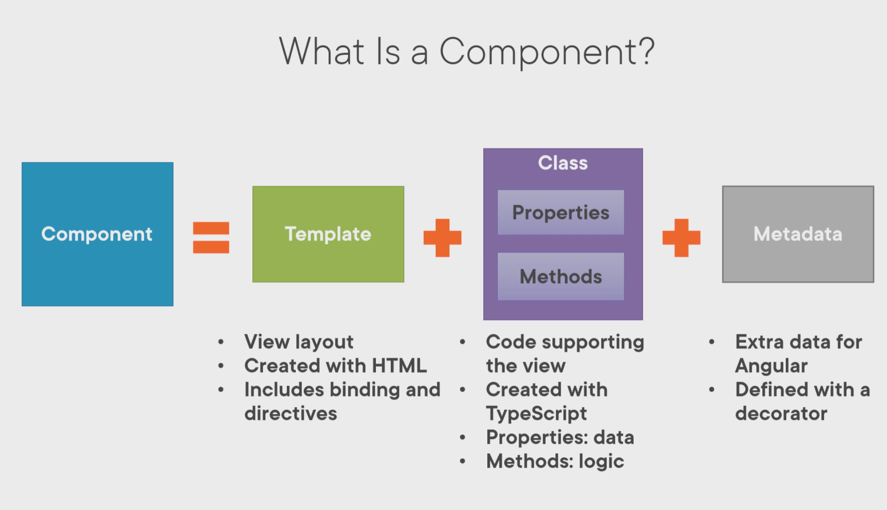

# Angular getting started

# Testing

Testing tools:

- Karma
- Protractor
- alternatives:
  - Jest
  - theIntern
  - Cypress.io
- Angular Testing Utilities
  - TestBed
  - Async & FakeAsync
  - MockBackend

# Pipes

**Pure vs. impure**

- **Pure**
  - only evaluated when imput changes (simple)
- **Impure**
  - evaluated on every change detection cycle (complex)

## Examples

```
{{ product.productCode | lowercase }}
< img [src] = 'product.imageUrl'
      [title]='product.productName | uppercase'>

{{ product.price | currency | lowercase }}
{{product.price | currency:'USD':'symbol':'1.2-2'}}
```

The 1.2-2 means there is 1 number before the . there are 2 behind and no more then 2 behind the ...

## Custom Pipe

```
import { PIpe, PipeTransform } from '@angular/core';

<!-- pipe decorator to define it as a pipe- it's a function so it requires{} -->
@Pipe ({
  name: 'convertToSpaces'
})

<!-- class -->
export class ConvertToSpacesPipe implements PipeTransform {

<!-- Here we transform a string  -->
  transofrm (value: string,
              character: string): string
              }
}
```

# Components



```

import { Component } from '@angular/core';

@Component({
selector: 'pm-root',
template:` <div><h1>{{pageTitle}}</h1> <div>My First Component</div> </div> `
})
export class AppComponent {
pageTitle: string = 'Acme Product Management';
}

```

## Creating Component class

A class is a construct that allows us to create a type with properties that define the data elements and methods that provide functionality.

convention:

- Name each component class with a feature name + component
- root component for an application is called AppComponent

```

pageTitle: string = 'Acme Product Management';

```

- Property name = noun describing the data element & camelCase;
- _pageTitle_
- Data Type = string, integer, float, character, boolean;
- _string_
- Default Value

## Defining the Metadata

**Decarator**

- is a function that adds _metadata_ to a class, its members, or its method arguments
- Prefixed with an @.
- Apply the decorator immediately before the feature you are decorating
- component always has a template

```

@Component({
selector: 'pm-root',
template:` <div><h1>{{pageTitle}}</h1> <div>My First Component</div> </div> `
})

```

## import statement

Allows us to use exported members from:

- other files in the application
- Angular framework
- external JS libraries

In the example we import from angular core

```

import { Component } from '@angular/core';

```

import = keyword
component = member name
@angular/core= angular library + module name

## Component checklist

Class -> Code
Decorator -> Template & Metadata
Import what you need

## Class

Clear name

- use PascalCasing
- Append "Component" to the name

export **keyword**

## Members

Data in properties

- Appropriate data type
- Appropriate default Value
- camelCase

Logic in methods

- camelCase

## Metadata

**Component decorator**

- prefix with @; Suffix with ()

**selector**: Component name in HTML

- Prefix for clarity

**Template**: view's in HTML

- Correct HTML syntax

## Import statement

- Defines where to find members that this component needs
- import keyword
- Member name: correct spelling/PascalCasing
- Path: Enclose in quotes, correct spelling/casing

## Defining interfaces

**An interface is a specification identifying a related set of properties and methods** </br>
_properties are the data elements associated with the class, and methods perform the logic required for the class_

### Two ways to Use an interface

**As a data type**

```

export interface IProduct {
productId: number;
productName: string;
productCode: string;
realeaseDate: string;
price: number;
description: string;
starRating: number;
imageUrl: string;
}

```

```

products: Iproduct[] = [];

```

**As a feature set**

```

export interface DoTiming {
count: number;
start (index: number): void;
stop(): void;
}

```

```

export class myComponent
implements DoTiming {
count: number = 0;
start(index: number): void {
...
}
stop(): void {
...
}
}

```

```

export interface IProduct {
productId: number;
productName: string;
productCode: string;
realeaseDate: string;
price: number;
description: string;
starRating: number;
imageUrl: string;
}

```

**export**= keyword </br>
**interface**= keyword </br>
**Iproduct**= interface name - usually with I for interface as prefix

Once you have defined the interface, you can import it as a datatype

```

import { IProduct } from './product';

export class ProductListComponent {
pageTitle: string = 'Product List';
showImage: boolean = 'false';
listFilter: string = 'cart';

products: Iproduct[]=[...];

toggleImage():void {
this.showImage = !this.showImage;
}
}

```

# Component styles

### Encapsulating Component styles

Using the styles property

```

@Component({
selector:'pm-products',
templateUrl:'./product-list.component.html'
styles: ['thead {color: #337AB7;}']
})

```

Using the StyleUrl property

```

@Component({
selector:'pm-products',
templateUrl:'./product-list.component.html'
styleUrls:['./product-list.component.css']
})

```

# Component Lifecycle


 </br>
 </br>

_A Lifecycle hook is an interface we implement to write code when a component lifecycle event occurs._

## What makes a component nest-able?

1. Its template manages a fragment of a larger view
2. It has a selector (so it can be used as a directive )
3. It optionally communicates with its container

## Three most common lifecycle hooks

1. OnInit: Perform component initialization, retrieve data
2. onChanges: Perform action after change to input properties
3. OnDestroy: Perform cleanup

## Using a lifecycle hook

```

<!-- Step one -->

import { Component, OnInit } from '@angular/core';

<!-- Step two -->

export class ProductListComponent implements OnInit {
pageTitle: string = 'Product List';
showImage: boolean = false;
listFilter: string = 'cart';
products: IProduct[] = [...];

  <!-- Step three -->

ngOnInit(): void {
console.log('In OnInit');
}
}

```

# Data Binding

## Interpolation

one-way binding; from the class property to the template

{{pageTitle}} --> is called a Template Expression


# Logic with Directives

## Angular built-in Directives

Structural Directives :

- \*ngIf: If Logic
- \*ngFor: For loops

\*ngIf removes or recreates a portion of the document object model tree based on an expression.

\*ngFor Buil-inDirective repeats a portion of the DOM tree of each item in an irreterable list

let product creates a variable called product so you can reference this variable


Difference - in as in iterating the INdex

# Template checklist

**inline template:**

- for short templates
- specify the template property
- use the ES 2015 back ticks for multiple lines
- watch syntax

```

template:

<div> <h1> {{pageTitle}}</h1>
<div> My First Component </div>
</div>
```

**Linked template**

- For longer templates
- specify the templateUrl Property
- Define the path to the HTML file

```
templateUrl: './product-list.component.html'
```

**Interpolation**
_One way binding_

- From component class property to an element property
  _Defined with double curly braces_
- Contains a template expression
- No quotes needed

```
<td>{{product.productName}}</td>
```

**Structural directives**

*ngIf and *ngFor

- prefix with an asterisk
- Assign to a quoted string expression

**\*ngIF**

Add or remove an element and its children from the DOM

expression is evaluated:

- **true**: elements added to the DOM
- **false**: elements removed from the DOM

```
<table *ngI='products'>
```

**\*ngFor**
Repeat an elemen and its children in the DOM

- For each object in an iterable list

Define the local variable with let
specify 'of'

```
<tr *ngFor='let product of products'>
...
</tr>
```

# Property Binding

```

```

<[element propert] = 'template.Expression'>

# Event Binding

**Template**

```
<h1> {{pageTitle}}</h1>

<button (click)='toggleImage()'>
```

**Component**

```
export class ListComponent {
  pageTitle = 'Product List';
  products: any[] = [...];
  toggleImage(): void {...}
}
```


## Two-way binding

```
[(ngModel)]
```

Use a banana in a box [()]

# Data binding checklist & summary


</br>


### ngModel

```
<div class='col-md-4'>
  <input type='text'
    [(ngModel)]='listFilter' />
</div>
```

```
@NgModule({
  imports: [ BrowserModule,
  FormsModule],
  declarations: [
    AppComponent,
    ProductListComponent  ],
    bootstrap:[AppComponent]
})
export class AppModule { }
```

### Pipes

Pipe character |
Pipe name
Pipe parameters

- separated with colons

Example

```
{{ product.price | currency: 'USD': 'symbol': '1.2-2'}}
```

# Filtering a List

```
products: IProduct[] = [...];
```

```
performFilter(): IProduct[] {
  return this.products.filter((product: IProduct) =>
      product.productName.includes(this.listFilter));
}
```

# Getters & Setters


</br>
</br>
</br>
</br>
</br>

# Arrow Function


# Interface Checklist:

## Interface as a type

- interface keyword
- Properties and their types
- export it

```
export interface IProduct {
  productId: number;
  productName: string;
  productCode: string;
  ...
}
```

- Use the interface as a data type

```
products: IProduct[] = [...];
```

## Interface as a Feature set

**Implementing interfaces:**

- implements keyword & interface name
- Write code for each property & method

```
import { Component, OnInit } from '@angular/core';

export class ProductComponent implements OnInit {
  ngOnInit(): void {
    console.log( 'In OnInit');
  }
}
```

# Styles Checklist

## Encapsulating Styles

**Styles property**

- Specify an array of style strings
  **styleUrls property**
- Specify an array of stylesheet paths []

# Lifecycle hook

## Using Lifecycle hooks

1. Import the lifecycle Hook interface
2. Implement the lifecycle hook interface
3. Write code for the hook method

```
import { Component, OnInit } from '@angular/core';

export class ProductComponent implements OnInit {
  ngOnInit(): void {
    console.log ('In OnInit');
  }
}
```

# Pipe Checklist

## Building a Custom Pipe

Create a class that implements PipeTransform
Write code for the Transform method
Decorate the class with the Pipe decorator

```
import { Pipe, PipeTransform } from '@angular/core';

@Pipe({
  name: 'spacePipe'
})
expor class SpacePipe implements PipeTransform {
  transform( value: string,
  character: string): string { ...}
}
```

## Using a custom Pipe

Add the pipe to the delcarations array of an Angular module

```
@NgModule({
  imports: [...],
  declarations: [
    AppComponent,
    ProductListComponent,
    SpacePipe ],
    bootstrap: [ AppComponent ]
})
export class AppModule { }
```

Use the pipe in a template:

- Pipe character
- Pipe name
- Pipe arguments(separated with colons)

```
{{ product.productCode | spacePipe: '-'}}
```

# Nested Component Checklist


## Input properties

- input decorator
- Attach to a property of any type
- Prefix with @ Suffix with ()

```
export class StarComponent {
  @Input() rating: number;
}
```

## Output properties

- output decorator
- Attached to a property declared as an EventEmitter
- Use the generic argument to define the event data type
- Use the new keyword to create an instance of the EventEmitter
- prefix with @; Suffix with ()

```
export class StarComponent {
  @Output() notify: EventEmitter<string> =
                          new EventEmitter<string>();
}
```

## Container Component

- Use the directive
  - Directive name -> nested component's selector
- Use property binding to pass data to the nested component
- Use event binding to respond to events from the nested component
  - Use $event to access the event data passed from the nested component

```
<pm-star [rating]='product.starRating'
          (notify)='onNotify($event)'>
</pm-star>
```

# Dependency injection

_A coding pattern in which a class receives the instances of objects it needs (called dependencies) from an external source rather than creating them itself._

## Building services

**Product.service.ts**

```
import { Injectable } from '@angular/core'

@Injectable()
export class ProductService {
  getProducts(): IProduct [] {

  }
}
```


## Registering a Service - Root application

**product.service.ts**

```
import { Injectable } from '@angular/core'

@Injectable({
  providedIn: 'root'
})
export class ProductService {
  getProducts(): IProduct[] {
  }
}
<!-- This service is available everywhere -->
```

**product-list.component.ts**

```
@Component({
  templateUrl: './product-list.component.html'
  providers: [ProductService]
})
export class ProductListComponent { }
<!-- This service is available only within this component -->
```

**This is an older way to do it**

**app.module.ts**

```
@NgModule({
  imports: [BrowserModule],
  declarations: [ AppComponent],
  bootstrap: [AppComponent],
  providers: [ProductService]
})
export class AppModule{ }
```

## Injecting the service

Inpendency injection is done with a constructor

primarily used for initialization.

```
import { ProductService } from './product.service';

@Component({
  selector: 'pm-products',
  templateUrl:'./product-list.component.html'
})
export class ProductListComponent {
  <!-- private _productService;
  constructor(productService: ProductService) {
    this._productService = productService;
  } -->
  <!-- short-handed version -->
    constructor (private productService: ProductService) {}
}
```

# Service Checklist

## Building a service

**Service class**

- Clearname
- use PascalCasing
- Append "Service" to the name
- export keyword

**Service decorator**

- Use InjectablePrefix with @; suffix with ()

import what you need

```
import { Injectable } from '@angular/core';
@Injectable({
  providedIn: 'root'
})
export class ProductService {...}
```

## Registering a service

**Select the appropriate level in the hierarchy**

- Root application injector if the service is used througout the application
- Specific component's injector if only that component uses the service
  **Service Injectable decorator**
- Set the providedIn property to 'root'

```
@Injectable({
  providedIn:'root'
})
export class ProductService {...}
```

**Component decorator**

- Set the providers property to register the service

## Dependency injection

- Specify the service as a Dependency
- Use the constructor parameters
- Service is injected when component is instantiated

```
constructor(private productService: ProductService) { }
```

# Retrieving data using HTTP calls

_To understand the HTTP code, it's important to understand Reactive Extensions and Observables_

## Reactive EXtensions (RxJS)

- A library for composing data using observable sequences
- And transforming that data using operators
  - Similar to .NET LINQ operators
- Angular uses Reactive Extensions for working with data
  - Especially asynchronous data

### Synchronous vs. asynchronous

**Synchronous**: Real time - _like a phone call_
**Asynchronous**: No immediate response - _Like answering an email, you can do that whenever you want to_

**HTTP requests are asynchronous: request and response**


### Observable

A Collection of items over time

- Unlike an array, it doesn't retain items
- Emitted items can be observed over time
  - An observable is more like mouse clicks
  -

_What does an Observable do?_

- Nothing until we **subscribe**
- **Next:** next item is Emitted
  - Like tracking keypresses
- **Error:** An error occurred an no more items are Emitted
- **Complete:** No more items are emitted


This is what the request and response looks like for the app

## Common Observable Usage

- Start the observable **subscribe**
- **Pipe** emitted items through a set of operators
- process notifications: **next, error, complete**
- Stop the Observable **unsubscribe**

**By convention**: suffix with a $ to reference to an observable
**Example**

```
import { Observable, range, map, filter } from 'rxjs';

const source$: Observable<number> = range(0, 10);

source$.pipe(
  map( x => x * 3),
  filter( x => x % 2 ===0)
).subscribe ( x => console.log(x));
```

map transform each emitted item multiplied by 3
filter decides which items to pass an and which to emit out.

## Exception Handling

```
import { HttpClient, HttpErrorResponse } from '@angular/common/http';
import { Observable, catchError, tap } from 'rxjs';

getProducts(): Observable<IProducts[]> {
  return this.http.get<IProducts[]> {
    tap(data => console.log('All: ', JSON.stringify(data))),
    catchError(this.handleError)
    );
  }
  private handleError(err: HttpErrorResponse) {
}
```
## Subscribing to an observable
observables are lazy, they don't do anything until you subscribe.
You subscribe with an observer - this observes the stream and responds to three types of notifications:
1. next
2. complete
3. error

The user object is used to define handler functions that execute on these notifications
next --> processes the next emitted value, it is called for each value the observable emits
error --> it executes if there is an error
complete --> executes on comopletions

```
x.subscribe()
x.subscribe(observer)
x.subscribe({
  nextFn,
  errorFn,
  completeFn
})
```

complete is rarely used with http requests because they automatically complete after emitting the single response.

## Unsubscribing from an observable

1. Store the subscription in a variable
2. Implement the OnDestroy lifecycle hook
3. Use the subscription variable to unsubscribe
   
You subscribe in the `ngOnInit()` 
e.g. 
```
ngOnInit(): void {
  this.sub = this.hello.getAnswers().subscribe){

  }
}
``` 
Then you unsubscribe in the `ngOnDestroy()`
```
ngOnDestroy(): void {
this.sub.unsubscribe();
}
```

# Navigation & Routing

- Routing is component based
- Angular provides a router module (RouterModule).
- The router uses a first match win strategy, so the order matters.


```
[
  { path: 'products', component: ProductListComponent },
  { path: 'products/:id', component: ProductDetailComponent },
  { path: 'welcome', component: WelcomeComponent },
  { path: '', redirectTo: 'welcome', pathMatch":'full' },
  { path: '**', component: PageNotFoundComponent }, 
  //wildcard
]
```
<strong>
Add each rtoute to `forRoot`array
</strong>

path: url segment for the route
- no leading slash
- '' for default route
- '**' for wildcart route

<strong> when you have routes configured, you need to tie them </strong>

add the RouterLink directive as an attribute
- clickable element
- enclose in square brackets

Bind to a link parameters array
- First element is the path
- All other elements are route parameters

Add RouterOutlet directive
- Identifies where to display the routed compobnent's view
- Specified in the host component's template

```
<ul> 
<li><a [routerLink]="['/welcome']">Home</a></li>
</ul>
<router-outlet></router-outlet>
```

## Passing parameters to a route

**app.module.ts - or routing.module.ts**
```
{ path: 'products/:id', component: ProductDetailComponent },
```

**product-list.component.html**
```
<td>
<a [routerLink]="['/products', product.productId]"> {{product.productName}}
</a>
</td>
```
**product-detail.component.ts**
```
import { ActivatedRoute} from '@angular/router`;

constructor (private route: ActivatedRoute) { }
```

### Reading parameters from a route

**Snapshot: Read the parameter one time**
```
this.route.snapshot.paramMap.get('id');
```

**Observable: Read emitted parameters as they change**
```
this.route.paramMap.subscribe(
  params => console.log(params.get('id'))
);
```
**Specified string is the route parameter name**
```
{ path: 'products/:id',
component: ProductDetailComponent }
```

## Handling Null and Undefined

? -> safe navigation operator (Elvis operator)
it guards against null or undefined values.
If the product is null or undefined the safe navigation operator simply returns null and does not attempt to access the property.
```
product?.productName
```

alternative is to use ngIf

the safe navigation operator does not work with the ngModel
## Activating a Route with Code

Routing with code is commonly used when trying to save data. 
So when you press the button, you also save some data and then re-route back to another page.

```
import { Router } from '@angular/router';
constructor (private router: Router) { }
onBack(): void {
  this.router.navigate([/'products']);
}
```

## Protecting Routes with Guards

CanActivate
- Guard navigation to a route
CanDeactivate
- Guard navigation from a route
Resolve
- pre-fetch data before activating a route
CanLoad
- prevent asynchronous routing


```
@Injectable({
  providedInL: 'root'
})

export class PRoductDetailGuard implements CanActivate {
  canActivate(): boolean {
    ...
  }
}
```
You also have to add the guard in the routing

```
{ path: 'product/:id', 
  canActivate: [ ProductDetailGuard ],
  component: ProductDetailComponent }
  ```

adding it to the cli: the 2nd G stands for guard
```
  ng g g products/product-detail
  ```

# Angular Modules


**Bootstrap array**
1. Every application must bootstrap at least one component, the root application component.
2. The bootstrap array should only be used in the root application module, Appmodule.

**Declarations Array**
1. Every component, directive and pipe we create must belong to one and only one Angular module.
2. Only declare components, directives and pipes
3. All declared components, directives and pipes are private by default; they are only accessible to other components, directives and pipes declared in the same module.
4. The Angular module provides the template resolution environment for its component templates

**Import Array**
1. Adding a module to the import array makes available any components, directives and pipes defined in that module's exports array.
2. Only import what this module needs; For each component declared in the module, add to the imports array what is needed by the component's template.
3. Importing a module does NOT provide access to its imported modules
4. Imports array is used to register services provided by Angular or third-party modules. Import the module in the AppModule to ensure its services are registered one time

**Providers Array**
```
@Injectable({
  providedIn:'root'
})
```

**Shared Modules**
- organize commonly used pieces of our application
- export those pieces to share them

# Buildings, Testing and Deploying with the CLI

A command line interface for Angular
Purpose:
- Build an Angular application
- Generate Angular files
- Build and serve the application
- Run tests
- Prepare the application for deployment

## Ang CLI command Syntax

CLS clear cmd screen

ng -command- -args- -- -options-
```
ng new hello-world 
ng help
ng update
ng version
npm install -g @angular/cli
ng serve
```

- Components - ng g c <name>
- Directives - ng g d <name>
- Route guards - ng g g <name>
- Interfaces - ng g i <name>
- Modules - ng g m <name>
- Pipes - ng g p <name>
- Services - ng g s <name>

## testing in the CLI

```
ng test
```

## Building the application

```
ng build
```

# Angular forms
Reactive forms are better for unit testing and form validation.
If you just need to process regular html type forms use template-driven forms.
## Template-driven forms
**Used in Angular's FormsModule**
- imported in App Module

## Data Binding in Angular Forms
### Using NgForm
Using a template reference variable; #form
```
<form #form="ngForm">

</form>

{{ form | json }}

```
returns:
```
{ "_rawValidators": [], "_rawAsyncValidators": [], "_onDestroyCallbacks": [], "callSetDisabledState": "always", "submitted": false, "_directives": {}, "ngSubmit": { "closed": false, "currentObservers": null, "observers": [], "isStopped": false, "hasError": false, "thrownError": null, "__isAsync": false }, "form": { "_pendingDirty": false, "_hasOwnPendingAsyncValidator": false, "_pendingTouched": false, "_parent": null, "pristine": true, "touched": false, "_onDisabledChange": [], "_rawValidators": null, "_composedValidatorFn": null, "_rawAsyncValidators": null, "_composedAsyncValidatorFn": null, "controls": {}, "valueChanges": { "closed": false, "currentObservers": null, "observers": [], "isStopped": false, "hasError": false, "thrownError": null, "__isAsync": false }, "statusChanges": { "closed": false, "currentObservers": null, "observers": [], "isStopped": false, "hasError": false, "thrownError": null, "__isAsync": false }, "status": "VALID", "value": {}, "errors": null }, "__ngContext__": 2 }
```
it's inherited from AbstractControlDirective and it gives a lot of different form validations or properties.


### NgModel
Gets placed on every field that we want Angular to know about. Builds form.value
Requires the name attribute
```
   <div class="form-group">
      <label for="name">Name</label>
      <input id="name" class="form-control" ngModel/>
    </div>
```


### Creating a Data Model
- Use an interface
- Use a class
- DTO (>?)
### Two-way Data Binding
[(ngModel)]="variable" 
### Copying Form Data
To make sure that the original object is copied.
Do this with the spread operator
```
...
```
```
 userSettings : UserSettings = { ...this.originaluserSettings };
 ```

## Form Validation
### HTML5 Field Validation
- required
- pattern
- minLength
- maxLength
- min
- max
### CSS Classes for Validation
- ng-untouched
- ng-touched
- ng-pristine 
- ng-dirty
- ng-valid
- ng-invalid

 to debug these add #classTest to the input
 {{classTest.className}}


### NgModel OProperties for Validation
they are the same as the CSS classes for validation but without the prefix.
- untouched
- touched
- pristine 
- dirty
- valid
- invalid

To debug this:

```
<input proptertyTest="ngModel"/>

<h1> dirty : {{propertyTest.dirty }}</h1>
// dirty : false (or false)
```

### Styling Forms with Validation

```
/*the :not(form) ignores the whole form*/

.ng-invalid:not(form).ng-touched {
  border: 1px solid red;
}

```

```
 <div [hidden]="nameField.valid || nameField.untouched" class="alert alert-danger">Enter a name</div>
```
### Submitting Forms

In larger forms it is more common to get error msgs once the form is submitted

```
(ngSubmit)="onSubmit"
```
### Handling Form Control Events
(blur)=onBlur(#variablename)

## HTTP Form Posting and Data
import the Angular http client in the app.modules and then in the data service

```
  constructor(private http: HttpClient) { }

  postUserSettingsForm(userSettings: UserSettings) : Observable<any> {

   return this.http.post('https://putsreq.com/Z9RmWAio1BbJeIUobjTG', userSettings);

  }
  ```
### Create a Data Service
```
import { Injectable } from '@angular/core';
import {UserSettings} from "./user-settings";
import {Observable, of} from "rxjs";

@Injectable({
  providedIn: 'root'
})
export class DataService {

  constructor() { }

  postUserSettingsForm(userSettings: UserSettings) : Observable<UserSettings> {
    return of(userSettings);
  }
}

```

```
onSubmit(form: NgForm) {
    console.log('in onSubmit:', form.valid);
    this.dataService.postUserSettingsForm(this.userSettings).subscribe(
      result => console.log('success :', result),
      error => console.log('error', error)
    );
  }
  ```

### Handling Post errors
400 client side errors
500 something wrong with the server

```
onSubmit(form: NgForm) {
    console.log('in onSubmit:', form.valid);
    if (form.valid) {
      this.dataService.postUserSettingsForm(this.userSettings).subscribe(
        result => console.log('success :', result),
        error => this.onHttpError(error)
      );
    } else {
      this.postError = true;
      this.postErrorMessage = 'Please fix the above errors'
    }
  }
  
   postError = false;
   postErrorMessage = '';

   onHttpError(errorResponse: any) {
    console.log('error: ', errorResponse);
    this.postError = true;
    this.postErrorMessage = errorResponse.error.errorMessage
  }
  ```
  ### Retrieving Data for Select Element
.html dropdown input
```
<select name="subscriptionType" id="subscriptionType" class="form-control"
              [(ngModel)]="userSettings.subscriptionType">
        <option *ngFor="let type of subscriptionTypes |async">{{ type }}</option>

      </select>
```
.ts component
  ```
  subscriptionTypes: Observable<string[]>;

  ngOnInit() {
    this.subscriptionTypes =  this.dataService.getSubscriptionTypes();
}
  ```
data.service.ts
  ```
    getSubscriptionTypes() {
    return of(['Monthly', 'Annual', 'Lifetime'] )
  }
  ```

# Reactive forms

#RxJS in Angular: Reactive Development

**RxJS** = Reactive Extensions for JavaScript
*They were originally developed by Microsoft as Rx.NET*

*"RxJS is a library for composing asynchronous and event-based programs by using observable sequences"*

### Observe and React to Data as it Flows through Time

**Emit items**
**React to each emitted item**
- transform
- filter
- modify
**Combine**
**Cache**

### Why RxJs instead of...

- Callbacks
- Promises
- async/await

**RxJs**
- one technique to rule them all
- Compositional
- Watchfull
- lazy
- handle errors
- cancellable

**RxJS is used in:**
- Routing
```
this.route.paraMap
this.route.data
this.router.events
```
- Reacting Forms

```
this.productForm.valueChanges
```
- HttpClient
```
getProducts(): Observable<Product[]> {
  return this.http.get<Product[]>(this.url);
}
```

## Reactive development


## Observer/Subscriber
Observer observes and responds to notifcations.
*A collection of callbacks that knows how to listen to values delivered by the Observable*

*An obsterver is a consumer of Values delivered by an Observable*

*In RxJS, an Observer is also defined as an interface with next, error and complete methods.*


| Subscriber | Observer    |
| ---------- | ----------- |
| next()     | next()      |
| error()    | error()     |
| complete() | complete()) |

```
const observer = {
  next: apple => console.log('Apple emitted ${apple}`),
  error: => console.log('Error occurred: ${err}`),
  complete: () => console.log('No more apples, go home')
};
```

## Observable

**A Collection of events or values emitted over time**
- User actions
- Application events (routing, forms)
- Response from an HTTP request
- Internal structures

**Observables can Emit**
- Primitives; numbers, strings, dates
- Events: mouse, key, valueChanges, routing
- Objects: customers, products
- Arrays
- HTTP response

They can be synchronous & also Asynchronous
They can be used for finite and infinite emissions

The dollar sign implies that it can be observed as it emits items
```
const apples$ = new Observable(appleSubscriber => {
  appleSubscriber.next('Apple 1');
   appleSubscriber.next('Apple 2');
    appleSubscriber.complete();
})
```
*This is long form syntax, code us usually not used like this & you also miss the ubsubscribe*

## Subscribing
You need to subscribe to an emission in order to start the observer.

A cold observable won't start emitting until the item is subscribed.

A hot observable will keepon emitting, even with there is no subscription. 

```
const sub = apple$.subscribe(observer)
```
When you subscribe you pass the observer to observe for errors, steps of when it completes

**observable** --> collection of items emitted over time

**observer** --> set of callbacks to observe, handling next, error and complete

**Subscribe** --> just like spotify, you subscribe to a method


```
const observer = {
  next: apple => console.log('Apple emitted ${apple}`),
  error: => console.log('Error occurred: ${err}`),
  complete: () => console.log('No more apples, go home')
};

const apples$ = new Observable(appleSubscriber => {
  appleSubscriber.next('Apple 1');
   appleSubscriber.next('Apple 2');
    appleSubscriber.complete();
})

const sub = apples$.subscribe({
  next: apple => console.log('Apple emitted ${apple}`),
  error: => console.log('Error occurred: ${err}`),
  complete: () => console.log('No more apples, go home')
})
``` 

## Unsubscribing

```
const sub = apples$.subscribe({
  next: apple => console.log('Apple emitted ${apple}`),
  error: => console.log('Error occurred: ${err}`),
  complete: () => console.log('No more apples, go home')
})

sub.unsubscribe();

```

## Creation function

**OF**
```
const apples$ = of ('Apple1', 'Apple2' );
```
**FROM**
```
const apples$ = from [('Apple1', 'Apple2' )];
```
creates an observable from an array


**fromEvent**
```
@ViewChild('para') par: Elementref;

ngAfterViewInit(){
  const parStream = fromEvent(this.par.nativeElement, 'click')
                            .subscribe(console.log)
}
```

**interval**
```
const num = interval(1000).subscribe(console.log);
```

https://stackblitz.com/edit/angular-ivy-pgzyfu?file=src/app/app.component.ts

**Checklist**
**Terms**

**Observable**
- Collection of events or values emitted over time

**Observer**
- Observes notifications from the **Observable**
- Methods to process notifications;
  - next(), error(), complete()

**Subscriber**
- an **Observer** that can unsubscribe

**Subscription**
- Tells the **Observable** that the **Subscriber** is reader for notifications.
- subscribe() -- returns a **Subscription**
- **Subscription** is used to .unsubsribe()

**Creating an observable**

**Constructor**

**Creation Functions**
- of, from, fromEvent, interval, ... 
- create an **Observable** from anything

**To start receiving emissions**

1. **call** .subscribe()
2. **pass in an Observer** .next(), .error(), .complete
```
const sub = apples$.subscribe({
  next: apple => console.log('Apple emitted ${apple}`),
  error: => console.log('Error occurred: ${err}`),
  complete: () => console.log('No more apples, go home')
})
```

**Stop Creation Functions**
1. **use from or of** 
- They create a finite set of items, they will automatically emit all items and upon completion unsubscribe 
  
 2.  **Use an operatore that completes**
  - take
3. **Throw an error**
4. **Call** unsubscribe() on the subscription
   - . sub.unsubscribe();

if you subscribe, you should always unsubscribe 

# RXJS Operators

- An operator is a function
- Used to transform and manipulate emitted items

**Apply operators in sequence using the Observable's pipe() method**

 ```
of(2, 4, 6)
  .pipe(
    map(item => item *2),
    tap(item => console.log(item)),
    take(3)
  ).subscribe(item => console.log(item))
 ```

 - An RxJS operator is a function that transforms and manipulates items emitted from an observable. 
  
  1. Call in the .pipe() method
  2. pass in operators separated by commas map(), tap(), take()
  3. use arror functions/arguments to define the operation

 

 ## RxJS Operator: map

  1. Transforms each emitted item
     1. ``` map(item => item *2) ```
  2. For each item emitted in, one mapped item is emitted out

**Used for**:  Making changes to each emitted item

**Marble diagram: map**


**map is a transformation operator**
- Subscribes to its input Observable
- Creates an output Obsevable

**When an item is emitted**
- Item is transformed as specified by the provided function
- Transformed item is emitted t the output

## RxJS Operator: tap

**Taps into the emissions wouthout affecting the items**
```tap(item => console.log(item))```
**For each item emitted in, the same item is emitted out**

**Used for:**
- Debugging
- Performing actions outside of the flow of data(side effects)

```
of(2, 4, 6)
    .pipe(
      tap(item => console.log(item)),
      map(item => item * 2),
      tap(item => console.log(item)),
      map(item => item - 3),
      tap(item => console.log(item)),
    ).subscribe();
```

**Tap is a utility oprtator**
- Subscribes to its input Observable
- Creates an output Observable

**When an item is emitted**
- Performs a side effect as specified by a provided function
- Original item is emitted to the output Observable

## RxJS Operator: take

- **Emits a specified number of items**
``` take(2)```
- **Automatically completes**

**Used for:**
- Taking a specified number of items
- Limiting unlimited Observables 
  - e.g. when created by an interval Creation Function


```
 of(2, 4, 6)
    .pipe(
      tap(item => console.log(item)),
      map(item => item * 2),
      take(2),
      map(item => item - 3),
      tap(item => console.log(item)),
    ).subscribe();
```

**Take is a filtering operator**
- Subscribes to its input Observable
- Creates an output Observable

**When an item is emitted**
- Counts the item
  - if <= specified number, emits item to the output Observable
  - When it euqlas the specified number, it completes

**Only emits the defined number of items**

```
export class AppComponent implements OnInit {
  name = 'Angular ' + VERSION.major;

  ngOnInit() {
    from([20, 15, 10, 5])
      .pipe(
        tap((item) => console.log(`emitted item...${item}`)),
        map((item) => item * 2),
        map((item) => item - 10),
        map((item) => {
          if (item === 0) {
            throw new Error('zero detected');
          }
          return item;
        }),
        take(4)
      )
      .subscribe({
        next: (item) => console.log(`resulting item...${item}`),
        error: (err) => console.log(`error occurred ${err}`),
        complete: () => console.log('complete'),
      });
  }
}
```
https://stackblitz.com/edit/angular-ivy-kxpfum?file=src/app/app.component.ts

## map Operator Internal
it is just a function


## Summary

- **Use the observable pipe method to pipe emitted items through a sequence of operators**
```
from([20, 15, 10, 5])
.pipe(
  tap(item => console.log(item)),
  take(3),
  map( item => item * 2),
  map( item => item - 10)
);
```
- **Each operator's output Observable is the input Observable to the following operator**

**Map: transforms each emitted item**
``` map(item => item * 2) ```
**tap: Taps into the emitted items without modifying them, great for debugging**
``` tap(item => console.log(item))```
**take: emits the specified number of items and completes**
``` take(2)```

 # Reactive

 - Working with Observables directly
 - Leverage RxJS operators; transform, compose and combine
 - React to actions

- Importoves performances
- Handles states
- Reacts to users actions
- simplifies the code


## Async Pipe

``` products$ | async```

- Subscribes to the Observable when the component is initialized
- Returns each emitted value
- When a new item is emitted, component is marked to be checked for changes
- Unsubscribes when component is destroyed

### Common Pattern with an Async Pipe

**Product List Component**
```
products: Product[] = [];

constructor(private productService: ProductService){ }

ngOnInit(): void {
  this.productService.getProducts()
  .subscribe(products => this.products = products);
}
```
**Product List Component** - making it more reactive
the dollar sign indicates that it's an observable and not an array
```
products$: Observable<Product[]>;

constructor(private productService: ProductService){ }

ngOnInit(): void {
  this.products$ = this.productService.getProducts();
}

```
**Product List Template**
```
<div *ngIf="products">
<table>
  <tr *ngFor="let product of products">
    <td>{{ product.productName }}</td>
    <td>{{ product.productCde }}</td>
  </tr>
</table>
```


**Product List Template** - making it work with the new Observable property
```
<div *ngIf="products$ | async as products">
<table>
  <tr *ngFor="let product of products">
    <td>{{ product.productName }}</td>
    <td>{{ product.productCde }}</td>
  </tr>
</table>
```

### Handling Observable Errors
- Things can go wrong
- Catch Observable Errors
- Errors stops the Observable
- It won't emit an more items
- We cannot use it anymore

**Steps for error handling**

1. Catch the error
2. Optionally rethrow the error
3. Replace the errored Observable with new Observable

**RxJS Error Handling Features**
- catchError
- throwError
- EMPTY

**catchError**
- Catches any errors that occur on an Observable
```
catchError(this.handleError);
```
- Must be after any operator that could generate an error
- Used for catching errors
- In the Error handler:
  - Rethrow the error
  - Replace the errored Observable to continue after an error occurs

**Example**
```
of(2, 4, 6)
  .pipe(
    map(i => {
    if (i === 6) {
      throw 'Error!';
    }
    return i;
    }),
    catchError(err => of('six'))
  )
  .subscribe({
    next: x => console.log(x),
    error: err => console.log(err)
  });
```


**throwError**
- Creates an Observable that emits no items
- Immediately emits an error notification
```throwError(() => err)```

**Used for:**
- propagating an error
- Or use the throw statement

**EMPTY**
- Is an Observable that emits no items
- ```return EMPTY;```
- Immediately emits a complete notification
- 
**Used for**
- Returning an empty Observable

**Error Handling: Service**

Product Service
```
getProducts(): Observable<Product[]> {
return this.http.get<Product[]>(this.ProductsUrl)
  .pipe(
    tap(data => console.log(JSON.stringify(data))),
    catchError(err => {
      console.error(err);
      throw new Error('Could not retrieve'));
    })
  );
}
```
Product Component
```
this.product$ = this.productService.getProducts()
  .pipe(
    catchError( err => {
      this.errorMessage = err;
      return EMPTY;
    })
  );
```

**Benefits of an Async pipe**
- No need to subscribe
- No need to unsubscribe
- Improve change detection

*Angular uses change detection to track changes to application data so that it knows when to update the UI*

| Default                                                   | OnPush                                                                                              |
|-----------------------------------------------------------|-----------------------------------------------------------------------------------------------------|
| Uses the default checkAlways strategy                     | Improves performance by minimizing change detection cycles                                          |
| Every component is checked when: - Any change is detected | Component is only checked when: - @Input properties change - Event emits - A bound Observable emits |

```
@Component({
  templateUrl: './product-list.component.html
  changeDetection: ChangeDetectionStrategy.OnPush
})
```

**Declarative Pattern: Service**

**Pros**
- Leverage the power of RxJS Observables and operator
- Combine data streams
- Reacts to user Actions

##RxJS going reactive summary & checklist

**Going Reactive checklist** 
- Work with Observables directly
- Use an async pipe in the template to display emitted items
- Declare Observable properties instead of calling methods

**Handling Parameters Checklist**

procedural approach: pass parameters
```
getProducts(pageNumber): Observable<Product[]> {
  return this.http.get<Product[]>(this.productsUrl, {
    params: { page: pageNumber}
  });
}
```
declarative approach: react to actions
```
products$ = this.requestedPage$
  .pipe(
    switchMap(pageNumber =>
      this.http.get<Product[]>(this.productsUrl, {
        params: { page: pageNumber}
      }))
  );
```

**Async Pipe Checklist**
- Automatically subscribes when the component is rendered
- Processes each emitted item
- Automatically unsubscribes when the component is destroyed
- Use the 'as' syntax to map each emitted item to a variable
- 
  ```*ngIf="products$ | async as products">``` 
**Error Handling**

Procedural approach: errors ahndled in the subscribe
```
this.productService.getProducts()
  .subscribe({
    next: products => this.products = products,
    error: err => this.errorMessage = err
  });
```

Declarative approach: errors handled in the pipeline
```
products$ = this.productService.products$
  .pipe(
    catchError(err => {
      this.errorMessage = err;
      return EMPTY;
    })
  ); 
```

**Error Handling features**
- catchError: catches an error
  - ```catchError(this.handleError)```
- throwError: Throws an error along the subscriber chain
  - ```throwError(() => new Error('Could not retrieve'));```
- EMPTY: defines an empty Observable that comlpetes
  - ```return EMPTY;```

## Mapping Returned DATA

**Why Map returned data?**
- Modify a value
  - price = price * 1.5
- Transform a value
  -  'y'-> true; 'n'-> false;
- Change a field name
  - p_nm -> productName
- Add a calculated field
  - profit = price - cost


**Mapping an HTTP Response**
1. Map the emitted Array:
    -  ```map(products => products)```
   
2. Map each element in the array
3. Transform each element
   ```
       map(products =>
        products.map(product => ({
          ...product,
          price: product.price ? product.price * 1.5 : 0,
          searchKey: [product.productName]
        } as Product))),
   ```


**Mapping an HTTP Response checklist**

- When retrieving a set of data
- HTTP get returns an Observable that emits an array
```
products$ = this.http.get<Product[]>(this.productsUrl);
```

## Combining data streams

**Why combine data streams?**
- Map id to a string
- Work with multiple data sources
- React to actions
- Simplify template code

**RxJS Features**
- combineLatest
- forkJoin
- withLatestFrom

**Types of Combination Operators/Functions**


## RxJS Creation Function: combineLatest

**Creates an Observable whose values are defined:**
- using the latest values from each input Observable
  ``` combineLAtest([a$, b$, c$])```
  - static creation function, not a pipeable operator

**Marble Diagram: combine latest **


CombineLatest will only emit once all values have been observed. So it always has the same amount of elements. 
This also means that some elements may be dropped. 

**combinesLatest is a combination function**
- Takes in a set of Observable, subscribes
- Creates an output Observable

**When an item is emitted from any Observable**
- If all Observables have mitted at least once
- Emits a value to the output Observable

**Emitted value combines the latest emitted value from each input Observable into an array**

**When to use combineLatest**
- To work with multiple data sets
- to reevaluate state when an action occurs

## RxJS Creation Function: forkJoin

**Creates an Observable whose value is defined:**
- Using the last value from each input Observable
- ```forkJoin([a$, b$, c$])```
- Only emits one time, when all input Observables complete
- static creation function, not a pipeable operator

**Marble Diagram: forkJoin**


**Forkjoin is a combination function**
- Takes in a set of Observables, subscribes
- Creates an output Observable
**When all input Observables complete**
- Emits a value to the output Observable
- And Completes

**Emitted value combines the last emitted value from each input Observable into an array**

**When to use forkJoin**
- To wait to process any results until all Observables are complete
- When emitting individual items you'd like mitted as a single array
- Don't use forkJoin when working with Observables that don't complete
  - such as action streams

## RxJS Operator: withLatestFrom
**Creates an Observable whose values are defined:**
- Using the latest values from each input Observable
- But only when the source observable emits
- ```a$.pipe(withLatestFrom(b$, c$))```
- Pipeable operator


**Marble Diagram: withLatestFrom**


**withLatestFrom**
**WithLatestFrom is a combination operators**
- Takes in a set of Observables, subscribes
- Creates an output Observable

**When an item is emitted from the source Observable**
- if all Observables have emitted at least once
- Emits a value to the output Observable

**Emitted values combines the latest emitted value from each input Observable into an array**

**Completes when the source Observable completes**

**Use withLatestFrom**
- To react to changes in only one Observable
- To regulate the output of the other Observables

## Mapping an Id to a string
```
products$ = this.http.get<Product[]>(this.url);
```
```
productCategories$ = this.http.get<ProductCategory[]>(this.categoriesUrl);
```
```
productsWithCategory$ = combineLatest([
  this.products$,
  this.productCategories$
  ]).pipe(
    map(([products, categories]) =>
    products.map(product => ({
      ...product,
      price: product.price * 1.5,
      category: categories.find(
        c => product.categoryId === c.id
      }.name
    } as Product)))
  );
])
```